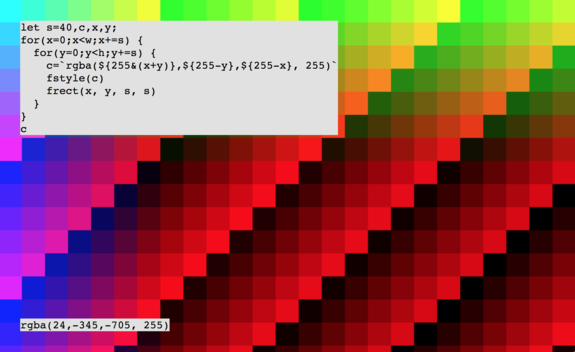

# repeat-editor

A simple editor for live coding [canvas](https://developer.mozilla.org/en-US/docs/Web/API/CanvasRenderingContext2D) graphics.

<a href="https://hermantorjussen.no/repeat/?id=JTJGJTJGJTIwZ2VuZXJhdGUlMjAyLWRpbWVuc2lvbmFsJTIwdGV4dHVyZSUyMHdpdGglMjBub2lzZSUyMGZ1bmN0aW9uJTBBJTJGJTJGJTIwdGhpcyUyMGlzJTIwdXNpbmclMjBzaW1wbGV4JTIwdW5kZXJuZWF0aCUyMChwZXJsaW4tbGlrZSklMEFmdW5jdGlvbiUyMGRyYXclMjAoKSUyMCU3QiUwQSUyMCUyMGJncm91bmQoJ3JnYmEoMjAlMkM4MCUyQzIwMiUyQzEpJyklMEElMjAlMjBsZXQlMjBzJTIwJTNEJTIwMTglMEElMjAlMjBsZXQlMjB4JTIwJTNEJTIwMCUzQiUyMGxldCUyMHklMjAlM0QlMjAwJTNCJTIwbGV0JTIwaW5jJTIwJTNEJTIwLTAuMDc4JTBBJTIwJTIwZm9yJTIwKGxldCUyMGklMjAlM0QlMjAwJTNCJTIwaSUyMCUzQyUyMHclM0IlMjBpJTIwJTJCJTNEJTIwcyUyQyUyMHglMjAlM0QlMjAwJTJDJTIweSUyMCUyQiUzRCUyMGluYyklMjAlN0IlMEElMjAlMjAlMjAlMjBmb3IlMjAobGV0JTIwaiUyMCUzRCUyMDAlM0IlMjBqJTIwJTNDJTIwaCUzQiUyMGolMjAlMkIlM0QlMjBzJTJDJTIweCUyMCUyQiUzRCUyMGluYyklMjAlN0IlMEElMjAlMjAlMjAlMjAlMjAlMjBsZXQlMjBuJTIwJTNEJTIwbWFwKG5vaXNlKHglMkMlMjB5KSUyQyUyMC0xJTJDJTIwMSUyQyUyMDAlMkMlMjAxKSUwQSUyMCUyMCUyMCUyMCUyMCUyMGZzdHlsZSglNjByZ2JhKDI1NSUyQzIyJTJDMjQlMkMlMjQlN0JuJTdEKSU2MCklMEElMjAlMjAlMjAlMjAlMjAlMjBmcmVjdChpJTJDJTIwaiUyQyUyMHMlMkMlMjBzKSUwQSUyMCUyMCUyMCUyMCU3RCUwQSUyMCUyMCU3RCUwQSU3RCUwQQ%3D%3D&hidden=false">
</a>


# example

To draw something on the canvas, use the [shorthand functions](./functions.md) or
standard canvas functions with the `ctx` global. The code is run once:

 ```js
fstyle('orange')
frect(500, 500, 100, 100)
 // or
ctx.fillStyle('orange')
ctx.fillRect(500, 500, 100, 100)
 ```

To run code in a loop, define a function called `draw()`.
The body of this function is called for each frame:

```js
fps(6)
fstyle('orange')
s=20

function draw () {
 for (x=0;x<w;x+=s) {
   for (y=0;y<h;y+=s) {
     frect(x, y, s-5, s-5)
   }
 }
}
```

Control the number of frames per second with `fps(n)`.
Look inside the [examples](examples) directory for examples and inspiration.

# usage

## alt+i
Show/hide help window with all functions

### cmd/ctrl+enter
Save and evaluate code. If the code errors, the error is displayed on the lower left.
The URL is updated with a shareable link.

### cmd/ctrl+shift+d
Duplicate current line

### cmd/ctrl+shift+k
Comment/uncomment current line

### cmd/ctrl+l
Select current line(s)

### back/forward
Back and forward buttons in the browser moves through save history.

### alt+f
Toggle fullscreen mode.

### alt+h
Toggle hiding code and output.

# installing

Clone this repo and with [npm](https://npmjs.com/) do:

```
npm install
npm start
```

It should open in your browser.


# inspiration

Inspired by https://hydra-editor.glitch.me made by https://github.com/ojack
and the programming module at https://www.khanacademy.org/computer-programming/new/pjs
and http://processingjs.org/.

# license

MIT

[1]: https://developer.mozilla.org/en-US/docs/Web/API/CanvasRenderingContext2D
