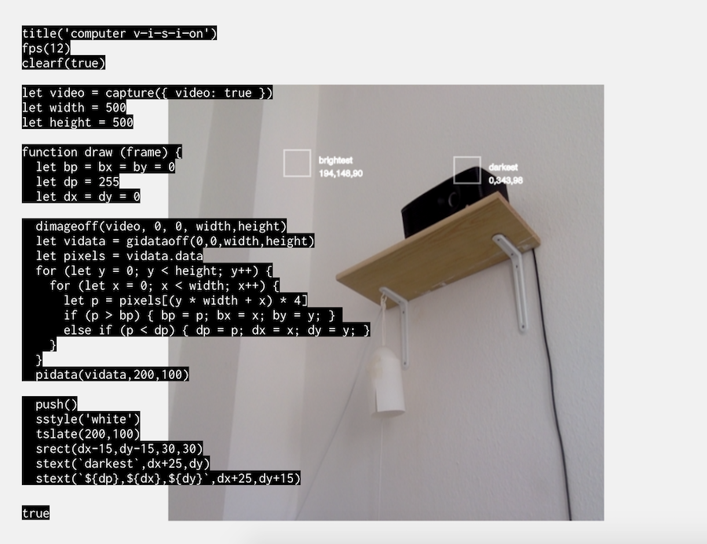

# repeat-editor

An editor for live coding [canvas](https://developer.mozilla.org/en-US/docs/Web/API/CanvasRenderingContext2D) graphics in the browser.

<a href="https://hermantorjussen.no/repeat/?id=dGl0bGUoJ2NvbXB1dGVyJTIwdiVFMiU4MCU5NGklRTIlODAlOTRzJUUyJTgwJTk0aSVFMiU4MCU5NG9uJyklMEFmcHMoMTIpJTBBY2xlYXJmKHRydWUpJTBBJTBBbGV0JTIwdmlkZW8lMjAlM0QlMjBjYXB0dXJlKCU3QiUyMHZpZGVvJTNBJTIwdHJ1ZSUyMCU3RCklMEFsZXQlMjB3aWR0aCUyMCUzRCUyMDUwMCUwQWxldCUyMGhlaWdodCUyMCUzRCUyMDUwMCUwQSUwQWZ1bmN0aW9uJTIwZHJhdyUyMChmcmFtZSklMjAlN0IlMEElMjAlMjBsZXQlMjBicCUyMCUzRCUyMGJ4JTIwJTNEJTIwYnklMjAlM0QlMjAwJTBBJTIwJTIwbGV0JTIwZHAlMjAlM0QlMjAyNTUlMEElMjAlMjBsZXQlMjBkeCUyMCUzRCUyMGR5JTIwJTNEJTIwMCUwQSUwQSUyMCUyMGRpbWFnZW9mZih2aWRlbyUyQyUyMDAlMkMlMjAwJTJDJTIwd2lkdGglMkNoZWlnaHQpJTBBJTIwJTIwbGV0JTIwdmlkYXRhJTIwJTNEJTIwZ2lkYXRhb2ZmKDAlMkMwJTJDd2lkdGglMkNoZWlnaHQpJTBBJTIwJTIwbGV0JTIwcGl4ZWxzJTIwJTNEJTIwdmlkYXRhLmRhdGElMEElMjAlMjBmb3IlMjAobGV0JTIweSUyMCUzRCUyMDAlM0IlMjB5JTIwJTNDJTIwaGVpZ2h0JTNCJTIweSUyQiUyQiklMjAlN0IlMEElMjAlMjAlMjAlMjBmb3IlMjAobGV0JTIweCUyMCUzRCUyMDAlM0IlMjB4JTIwJTNDJTIwd2lkdGglM0IlMjB4JTJCJTJCKSUyMCU3QiUwQSUyMCUyMCUyMCUyMCUyMCUyMGxldCUyMHAlMjAlM0QlMjBwaXhlbHMlNUIoeSUyMColMjB3aWR0aCUyMCUyQiUyMHgpJTIwKiUyMDQlNUQlMEElMjAlMjAlMjAlMjAlMjAlMjBpZiUyMChwJTIwJTNFJTIwYnApJTIwJTdCJTIwYnAlMjAlM0QlMjBwJTNCJTIwYnglMjAlM0QlMjB4JTNCJTIwYnklMjAlM0QlMjB5JTNCJTIwJTdEJTIwJTBBJTIwJTIwJTIwJTIwJTIwJTIwZWxzZSUyMGlmJTIwKHAlMjAlM0MlMjBkcCklMjAlN0IlMjBkcCUyMCUzRCUyMHAlM0IlMjBkeCUyMCUzRCUyMHglM0IlMjBkeSUyMCUzRCUyMHklM0IlMjAlN0QlMEElMjAlMjAlMjAlMjAlN0QlMEElMjAlMjAlN0QlMEElMjAlMjBwaWRhdGEodmlkYXRhJTJDMjAwJTJDMTAwKSUwQSUwQSUyMCUyMHB1c2goKSUwQSUyMCUyMHNzdHlsZSgnd2hpdGUnKSUwQSUyMCUyMHRzbGF0ZSgyMDAlMkMxMDApJTBBJTIwJTIwc3JlY3QoZHgtMTUlMkNkeS0xNSUyQzMwJTJDMzApJTBBJTIwJTIwc3RleHQoJTYwZGFya2VzdCU2MCUyQ2R4JTJCMjUlMkNkeSklMEElMjAlMjBzdGV4dCglNjAlMjQlN0JkcCU3RCUyQyUyNCU3QmR4JTdEJTJDJTI0JTdCZHklN0QlNjAlMkNkeCUyQjI1JTJDZHklMkIxNSklMEElMEElMjAlMjBzcmVjdChieC0xNSUyQ2J5LTE1JTJDMzAlMkMzMCklMEElMjAlMjBzdGV4dCglNjBicmlnaHRlc3QlNjAlMkNieCUyQjI1JTJDYnkpJTBBJTIwJTIwc3RleHQoJTYwJTI0JTdCYnAlN0QlMkMlMjQlN0JieCU3RCUyQyUyNCU3QmJ5JTdEJTYwJTJDYnglMkIyNSUyQ2J5JTJCMTUpJTBBJTIwJTIwcG9wKCklMEElN0QlMEE%3D&hidden=false">
</a>


# example

To draw something on the canvas use the shorthand functions or standard canvas functions on the `ctx` global.
Press F1 to get a list of shorthand functions.

 ```js
 // using shorthand
fstyle('orange')
frect(500, 500, 100, 100)
 // using standard
ctx.fillStyle('orange')
ctx.fillRect(500, 500, 100, 100)
 ```

To run code for each frame, define a function `draw(n)`.
This function will be called for each frame. Current frame number is passed as `n`:

```js
fps(6)
fstyle('orange')
var s=20,x=0,y=0

function draw (n) {
 for (x=0;x<w;x+=s) {
   for (y=0;y<h;y+=s) {
     frect(x, y, s-5, s-5)
   }
 }
}
```

Control the number of frames per second with `fps(n)`.
Look inside the [examples](examples) directory for examples and inspiration. Press F1 for more help.

# usage

### f1
Show/hide help window

### f2
Toggle hiding code and output

### f3
Toggle fullscreen mode

### cmd/ctrl+enter
Save and evaluate code. If the code errors, the error is displayed on the lower left.
The URL is updated with a shareable link.

### cmd/ctrl+shift+d
Duplicate current line

### cmd/ctrl+shift+k
Comment/uncomment current line

### cmd/ctrl+l
Select current line(s)

### back/forward
Back and forward buttons in the browser moves through save history.


# installing

Clone this repo and with [npm](https://npmjs.com/) do:

```
npm install
npm start
```

It should open in your browser.


# inspiration

Inspired by https://hydra-editor.glitch.me made by https://github.com/ojack
and the programming module at https://www.khanacademy.org/computer-programming/new/pjs
and http://processingjs.org/.

# license

MIT

[1]: https://developer.mozilla.org/en-US/docs/Web/API/CanvasRenderingContext2D
