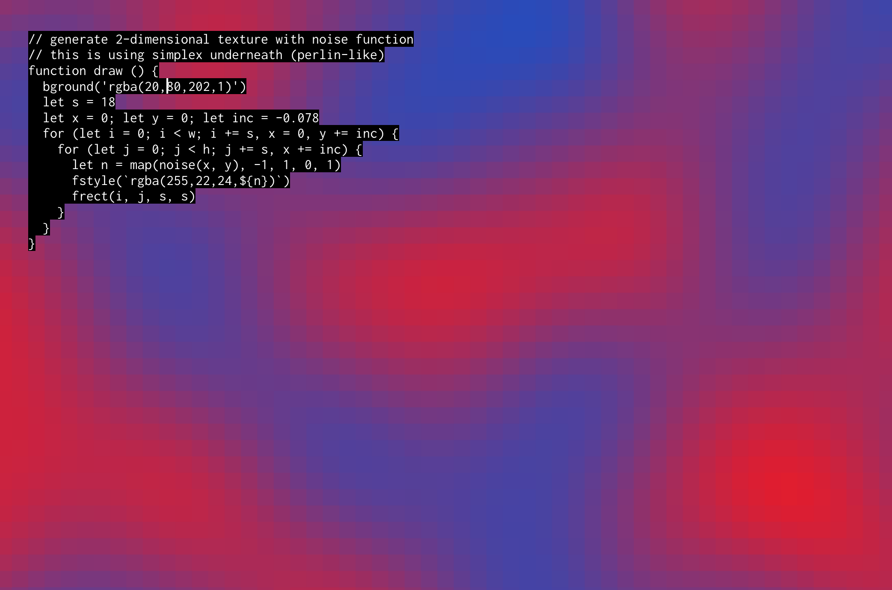

# framing

Online editor for live coding JS graphics with the 
[canvas API](https://developer.mozilla.org/en-US/docs/Web/API/CanvasRenderingContext2D). 
Try it out [here](https://framing.neocities.org/)!




# example

To draw something on the canvas use the shorthand functions or standard canvas functions on the `ctx` global.
Press F1 to get a list of shorthand functions.

 ```js
 // using shorthand
fstyle('orange')
frect(500, 500, 100, 100)
 // using standard
ctx.fillStyle('orange')
ctx.fillRect(500, 500, 100, 100)
 ```

To run code for each frame, define a function `draw(n)`.
This function will be called for each frame. Current frame number is passed as `n`:

```js
fps(6)
fstyle('orange')
var s=20,x=0,y=0

function draw (n) {
 for (x=0;x<w;x+=s) {
   for (y=0;y<h;y+=s) {
     frect(x, y, s-5, s-5)
   }
 }
}
```

Control the number of frames per second with `fps(n)`.
Look inside the [examples](examples) directory for examples and inspiration. Press F1 for more help.

# usage

### esc
Show/hide help window

### ctrl+h
Toggle hiding code and output

### ctrl+f
Toggle fullscreen mode

### cmd/ctrl+enter
Save and evaluate code. If the code errors, the error is displayed on the lower left.
The URL is updated with a shareable link.

### cmd/ctrl+d
Duplicate current line

### cmd/ctrl+k
Comment/uncomment current selection

### cmd/ctrl+l
Select current line(s)

### back/forward
Back and forward buttons in the browser moves through save history.


# installing
Clone this repo and with [npm](https://npmjs.com/) do:

```
npm install
npm run dev
```

It should open in your browser at [localhost:8080](http://localhost:8080).


# inspiration

Inspired by https://hydra-editor.glitch.me, the programming module at 
https://www.khanacademy.org/computer-programming/new/pjs and http://processingjs.org/.

# license

MIT

[1]: https://developer.mozilla.org/en-US/docs/Web/API/CanvasRenderingContext2D
